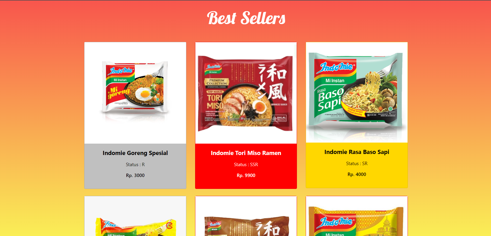
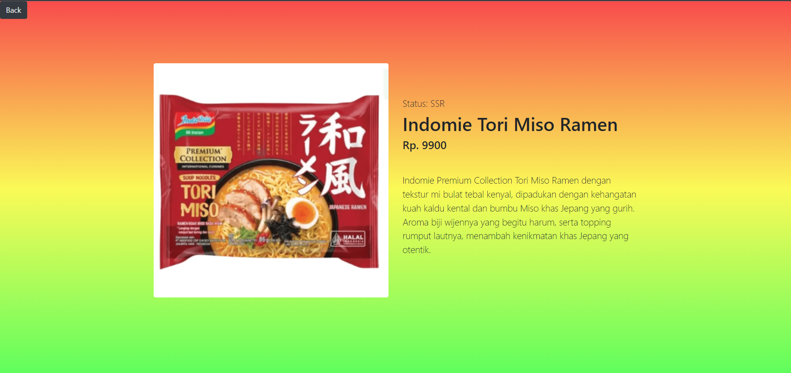
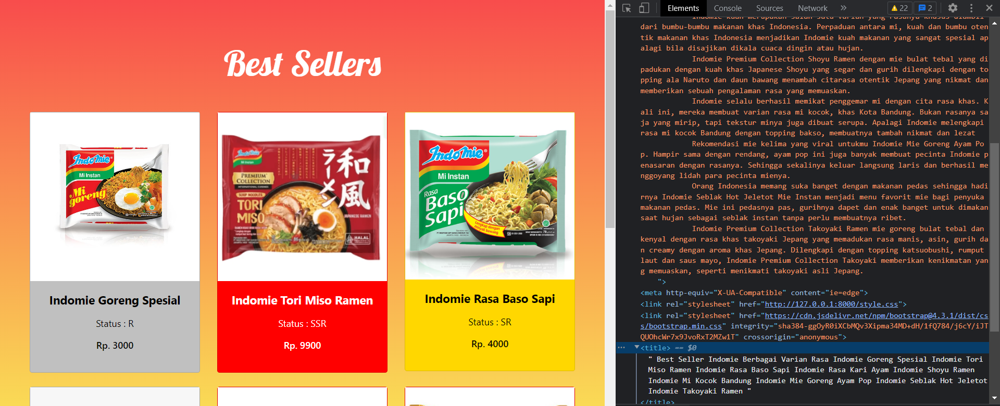

# INDOMIE SELERAKU~~~
This is a website made for Quiz of Web Programming Course on PPTI BCA x Binus University Program. The content consist of the showcase of some best selling Indomie variants. Why Indomie you asked? Who doesn't love Indomie! Not me of course.

<br />
<br />

## 👩‍💻 Information
|  |  |
| ------------- | ------------- |
| Name          | Vincent Kartamulya Santoso  |
| NIM           | 2502041344  |
| Class         | PPTI 12  |
| Lecturer      | Anderies, B.Eng., S.Kom., M.Kom.  |
| University    | Binus University x PPTI BCA (Hidup Binus! Hidup BCA!)|

<br />
<br />


## ⚡️ Content Requirements
- Product Name
- Status Product, which consist of R, SR, and SSR. For every status, there is specific color assigned to them, R is silver, SR is gold, and SSR is red.
- Product Price
- Product Description

<br />
<br />

## 🛠 Function used in this website
- Laravel
- CSS Framework: Bootstrap
- HTML
- CSS
- Javascript

<br />
<br />

## 1. Main Section



This is the main page where there are some of the best selling variants of Indomie. You can see the name, image, price, and status. Each status have their own color where you can see below
|Status  | Color |
| ------------- | ------------- |
| R (Rare) |  Silver  |
| SR (Super Rare) |  Gold  |
| SSR (Super Super Rare) |  Red|

There is an animation if you hover the card and if you click a card, it will go to the detail page of the chosen variant.


And for SEO purposes, the meta description for this page is consist of every description of the variant and the title if consist of name of every variants also.
The code being extends from master.blade.php as follow.
```bash
<meta name="viewport" content= "@yield('description')">
<title>@yield('title')</title>
```
Then in the child extended from master.blade.php there will be looping of keyword for every item as below.
```bash
@section('title')
    Best Seller Indomie Berbagai Varian Rasa
    @foreach ($produk as $item)
        {{$item['name']}}
    @endforeach
@endsection

@section('description')
    @foreach ($produk as $item)
        {{$item['desc']}}
    @endforeach
@endsection
```
<br />
<br />

## 2. Detail Section


In this page, you will find a more detail information about the chosen variant. You can see the image, status, price, name, and detailed description about the variants. On the top left corner, there is a back button if you want to go back to the main page.

How does the web know which detail of product to show? The answer is id. Every page have an ID which routes to the detail function of ProdukController which shown below

```bash
Route::get('/produk/{id}', [App\Http\Controllers\ProdukController::class,'detail']);
```

For SEO purposes, the meta description for this page is only specific for the selected product only and the title consist of name of the specific variant


Where for the code you can see below
```bash
@section('title')
    {{$item['name']}}
@endsection

@section('description')
    {{$item['desc']}}
@endsection
```

## Authors

- [@vincent-kartamulya](https://github.com/vincent-kartamulya/)
